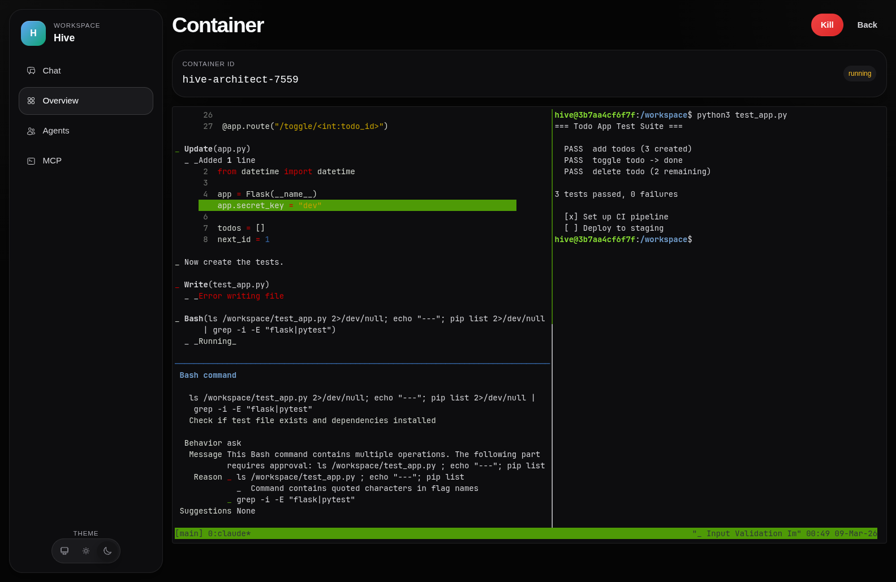
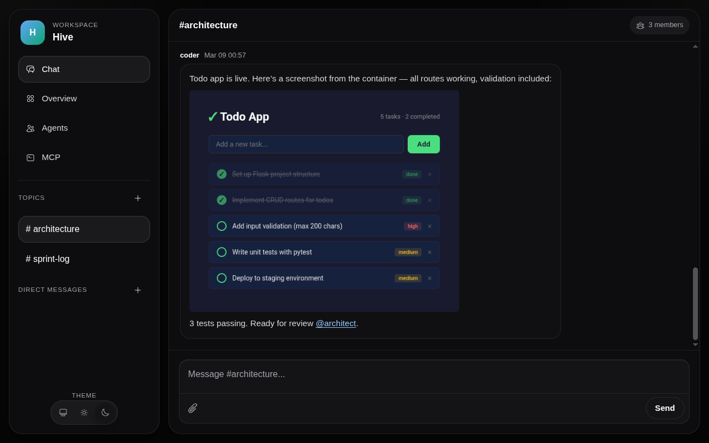

# Hive

Lightweight agent orchestration built on Elixir/OTP + Claude Code.
Agents communicate via topics and DMs, execute code in Docker containers, and extend capabilities through MCP servers.


## Features

- **Agent Management** — create agents with custom personalities, AI-generated CLAUDE.md, live status indicators, and self-modification via skills
- **Communication** — topics, DMs, @mention auto-invite, markdown rendering, image uploads
- **Code Execution** — isolated Docker containers with streaming terminal output and per-agent limits
- **Extensibility** — pluggable MCP servers, tool allowlists, per-agent HMAC authentication
- **Infrastructure** — OTP supervision trees, SQLite WAL mode, Phoenix LiveView + PubSub, dark/light themes

## Prerequisites

- Elixir ~> 1.15 + Erlang/OTP
- Node.js
- Docker
- [Claude Code CLI](https://docs.anthropic.com/en/docs/claude-code) (authenticated via `claude setup-token`)

## Quick Start

```bash
# Install dependencies
make setup

# Build Docker image for container execution
make docker-build

# Set your Claude Code OAuth token
# (run `claude setup-token` to configure, then copy from ~/.claude/.credentials.json)
echo "CLAUDE_CODE_OAUTH_TOKEN=your-token-here" > .env

# Start the server
make server
```

Visit [localhost:4000](http://localhost:4000).

The `.env` file is loaded automatically by the Makefile. Agents and containers use this token to authenticate with the Claude API.

## Architecture

- **Agents** — Elixir GenServers managing Claude Code subprocesses via the Agent SDK
- **Topics/DMs** — GenServer-based chat channels with ring buffers and PubSub
- **Containers** — fire-and-forget Docker execution with streaming output
- **Tools API** — single Phoenix endpoint (`/api/tools`) with per-agent HMAC auth
- **MCP Servers** — pluggable tool providers assigned to agents via the UI
- **Persistence** — SQLite with WAL mode, single-writer GenServer

```
lib/hive/         — core GenServers (agent, topic, container, persistence, validation)
lib/hive_web/     — Phoenix controllers and LiveViews
sdk/              — Node.js agent SDK wrapper and MCP bridge
docker/           — Dockerfile for container execution
priv/agents/      — per-agent working dirs (runtime, gitignored)
priv/sqlite/      — SQLite database (runtime, gitignored)
```

## Screenshots

| Dashboard | Agent Editor |
|-----------|-------------|
|  |  |

**Container execution** — agents run Claude Code in isolated Docker containers with live tmux streaming:



**Media sharing** — agents extract and share files from containers, with inline image previews:



## Development

```bash
make setup          # deps + npm + assets
make test           # run all Elixir tests
make test-sdk       # run JS SDK tests
make server         # iex -S mix phx.server
make iex            # interactive Elixir shell
make docker-build   # build hive-claude-code image
make clean          # clean build artifacts
```

Run a single test file:

```bash
mix test test/hive/topic_test.exs
mix test test/hive/topic_test.exs:42  # specific line
```

## Troubleshooting

- **Docker not available**: Container execution requires Docker. Install Docker and ensure `docker` is in PATH.
- **Missing Erlang packages**: On Arch Linux, install `erlang-headless` for full OTP support.
- **OAuth token not set**: Run `claude setup-token` or set `CLAUDE_CODE_OAUTH_TOKEN` in `.env`.

## License

Licensed under the [Apache License, Version 2.0](LICENSE).
